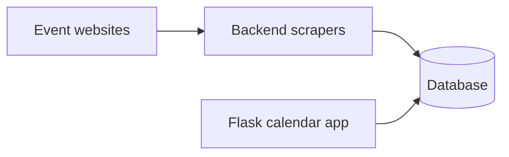

# Hong Kong Event Time

This repository contains the Flask calendar app that is deployed to Azure from `main`.

The previous FastAPI/Next.js duplicate stack has been removed so local work, GitHub Actions, and Azure all point at the same app code.

## Local Flask app

Event discovery app for Hong Kong with source-prioritized scraping, calendar and mobile list views, and per-source debug diagnostics.

### Setup

```bash
cd /Users/leozille/Downloads/hk-event-time
python3 -m venv .venv
source .venv/bin/activate
pip install -r requirements.txt
cp .env.example .env
python run.py
```

Open [http://127.0.0.1:5050](http://127.0.0.1:5050)

### Key endpoints

- `GET /api/categories`
- `GET /api/events?start=<ISO>&end=<ISO>`
- `POST /api/scrape-now`
- `GET /api/debug/sources`

## Deployment

Pushes to `main` run `.github/workflows/azure-deploy.yml`, which packages the Flask app and deploys it to Azure App Service `hk-event-time`.

The workflow sets the Azure app to use the writable SQLite path at `/home/data/events.db`, starts `wsgi:app` with Gunicorn, and waits for `/health` before the deployment is considered successful.

### High-level flow



## Notes

- SQLite remains the active local DB unless you switch `DATABASE_URL`.
- On Azure, app settings should keep `SCM_DO_BUILD_DURING_DEPLOYMENT=true`, `ENABLE_ORYX_BUILD=true`, `FLASK_ENV=production`, and `DATABASE_URL=sqlite:////home/data/events.db`.
