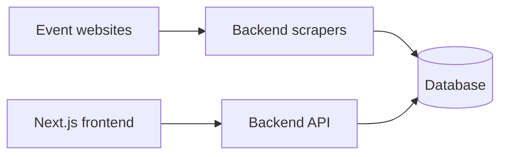

# Hong Kong Event Time

This repository now contains two local code paths that have been merged together:

- the original Flask calendar app in the repo root (`app/`, `static/`, `templates/`, `run.py`)
- the newer GitHub-published split stack under `backend/` and `frontend/`

Your current local preview work is still based on the root-level Flask app and runs at [http://127.0.0.1:5050](http://127.0.0.1:5050).

## Local Flask app

Event discovery app for Hong Kong with source-prioritized scraping, calendar and mobile list views, and per-source debug diagnostics.

### Setup

```bash
cd /Users/leozille/Downloads/hk-event-time
python3 -m venv .venv
source .venv/bin/activate
pip install -r requirements.txt
cp .env.example .env
python run.py
```

Open [http://127.0.0.1:5050](http://127.0.0.1:5050)

### Key endpoints

- `GET /api/categories`
- `GET /api/events?start=<ISO>&end=<ISO>`
- `POST /api/scrape-now`
- `GET /api/scrape-status`
- `GET /api/debug/sources`

## New GitHub backend/frontend stack

The fetched GitHub version also adds:

- `backend/` with a newer API/scraper structure
- `frontend/` with a Next.js UI
- `.github/workflows/` deployment workflows
- `docker-compose.yml` and Postgres-oriented local setup

That stack has not replaced your root Flask app locally; it has been merged alongside it so you can compare, reuse, or gradually port pieces across.

### High-level flow of the newer stack



## Notes

- SQLite remains the active local DB for the root Flask app unless you switch `.env`.
- The merged repo currently includes build artifacts and cached Python files from GitHub history under `backend/app/frontend_out/` and some `__pycache__` directories.
- If you want, the next step can be a cleanup pass where we decide which stack should become the single main app and remove the rest.
