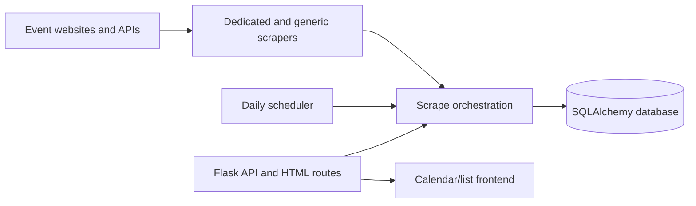

# Hong Kong Event Time

Hong Kong Event Time is a Flask calendar app for discovering upcoming events in Hong Kong. It combines source-prioritized scraping, category inference, a SQLite/PostgreSQL-ready backend, and a responsive calendar/list interface tailored for nightlife, music, culture, food, sports, and business events.

Production is deployed from `main` to Azure App Service:

[https://hk-event-time-chc0gye3c5byckcq.southeastasia-01.azurewebsites.net/](https://hk-event-time-chc0gye3c5byckcq.southeastasia-01.azurewebsites.net/)

## What It Does

- Shows Hong Kong events in a browser calendar with event details, colors, and category filters.
- Scrapes multiple event sources with dedicated and generic scrapers.
- Stores normalized event data through SQLAlchemy.
- Runs a daily background scrape through APScheduler.
- Exposes JSON endpoints for the frontend, health checks, manual scraping, and source diagnostics.
- Deploys as a single Flask app through GitHub Actions and Azure App Service.

The repo intentionally uses one application stack only: `app/`, `templates/`, `static/`, `run.py`, and `wsgi.py`. The previous duplicate FastAPI/Next.js stack has been removed.

## Project Structure

```text
.
├── app/
│   ├── main.py                 # Flask app factory, routes, API endpoints
│   ├── config.py               # Environment-driven runtime configuration
│   ├── database.py             # SQLAlchemy engine/session setup
│   ├── models.py               # Event persistence model
│   ├── services.py             # Scrape orchestration and event queries
│   ├── scheduler.py            # Daily background scrape job
│   └── scrapers/               # Source-specific and generic scrapers
├── static/
│   ├── app.js                  # Calendar/list frontend behavior
│   └── styles.css              # Application styling
├── templates/
│   └── index.html              # Main Flask-rendered page
├── tests/                      # Unit tests for config, parsing, categories, UI assumptions
├── run.py                      # Local development entrypoint
├── wsgi.py                     # Production WSGI entrypoint
├── startup.sh                  # Azure App Service startup command
├── requirements.txt            # Python dependencies
└── runtime.txt                 # Azure Python runtime pin
```

## Quick Start

Requirements:

- Python 3.11+
- `pip`
- Optional: a virtual environment tool such as `venv`

Run locally:

```bash
python3 -m venv .venv
source .venv/bin/activate
pip install -r requirements.txt
python run.py
```

Open [http://127.0.0.1:5050](http://127.0.0.1:5050).

By default the app uses `sqlite:///events.db`, includes sample events, and focuses scraping on nightlife/music-oriented Hong Kong sources.

## Configuration

Configuration is read from environment variables in `app/config.py`.

| Variable | Default | Purpose |
| --- | --- | --- |
| `SECRET_KEY` | `dev-key-change-me` | Flask secret key. Use a real secret in production. |
| `DATABASE_URL` | `sqlite:///events.db` | Database connection string. SQLite works locally; PostgreSQL URLs are normalized for `psycopg`. |
| `SCRAPE_TIMEOUT_SECONDS` | `15` | Per-request scraper timeout. |
| `SCRAPE_USER_AGENT` | Desktop Chrome-like UA | User agent sent to event websites. |
| `SCHEDULE_HOUR_UTC` | `1` | Hour of the daily scheduled scrape. |
| `SCRAPE_MAX_DETAIL_PAGES_PER_SOURCE` | `12` | Detail-page cap per source. |
| `SCRAPE_MAX_MONTH_PAGES_PER_SOURCE` | `6` | Month-page cap per source. |
| `EVENTBRITE_API_TOKEN` | empty | Optional token for Eventbrite API-backed scraping. |
| `SCRAPE_INCLUDE_SAMPLE` | `1` | Adds sample Hong Kong events when enabled. |
| `SCRAPE_SOURCE_MODE` | `lkf_nightlife` | Source selection mode: focused nightlife set, `all`, or fallback source list. |
| `SCRAPE_FOCUS_CATEGORIES` | `party,music` | Comma-separated category filter for scrape persistence. |

Example local override:

```bash
DATABASE_URL=sqlite:///events.db \
SCRAPE_INCLUDE_SAMPLE=0 \
SCRAPE_SOURCE_MODE=all \
python run.py
```

## Scraping

Scrapers are built in `app/scrapers/sources.py`.

The app currently combines:

- dedicated scrapers for structured sources such as URBTIX, Luma, and Eventbrite;
- a generic multi-strategy HTML scraper for event pages;
- optional sample data so the UI remains useful in a fresh local checkout.

The default source mode is `lkf_nightlife`, which prioritizes Lan Kwai Fong, club, bar, music, meetup, Eventbrite, and Hong Kong event listing sources. Set `SCRAPE_SOURCE_MODE=all` to widen coverage.

Run a manual scrape through the API:

```bash
curl -X POST http://127.0.0.1:5050/api/scrape-now
```

Check source diagnostics:

```bash
curl "http://127.0.0.1:5050/api/debug/sources?run=1"
```

## API

### `GET /health`

Returns a simple health payload:

```json
{"status": "ok"}
```

### `GET /api/categories`

Returns the category metadata used by the frontend:

```json
[
  {
    "slug": "music",
    "label": "Music / Concert",
    "color": "#2f6df6",
    "text_color": "#f8fbff"
  }
]
```

### `GET /api/events`

Query events within a time range. `start` and `end` are required and can include timezone offsets. Naive datetimes are interpreted as Hong Kong time.

```bash
curl "http://127.0.0.1:5050/api/events?start=2026-05-01T00:00:00%2B08:00&end=2026-06-01T00:00:00%2B08:00"
```

Optional category filters can be repeated:

```bash
curl "http://127.0.0.1:5050/api/events?start=2026-05-01T00:00:00%2B08:00&end=2026-06-01T00:00:00%2B08:00&category=party&category=music"
```

### `POST /api/scrape-now`

Runs scraping immediately and returns the scrape summary.

### `GET /api/debug/sources`

Returns source configuration and upcoming event counts. Add `run=1` to run a detailed scrape diagnostic in the same request.

## Tests

Run the test suite with:

```bash
python -m unittest discover -s tests
```

The tests cover configuration normalization, category behavior, scraper parsing, timezone handling, and frontend quality assumptions.

## Deployment

Deployments are handled by `.github/workflows/azure-deploy.yml` on pushes to `main`.

The workflow packages and deploys the Flask app to Azure App Service:

- App Service: `hk-event-time`
- Resource group: `hk-event-time`
- Public URL: [https://hk-event-time-chc0gye3c5byckcq.southeastasia-01.azurewebsites.net/](https://hk-event-time-chc0gye3c5byckcq.southeastasia-01.azurewebsites.net/)
- Production entrypoint: `wsgi:app`
- Startup command: `startup.sh`
- Production SQLite path: `/home/data/events.db`

Important Azure settings:

```text
SCM_DO_BUILD_DURING_DEPLOYMENT=false
ENABLE_ORYX_BUILD=false
FLASK_ENV=production
DATABASE_URL=sqlite:////home/data/events.db
```

If Azure CLI is installed and authenticated, production can be inspected with:

```bash
az webapp config show --name hk-event-time --resource-group hk-event-time
az webapp log tail --name hk-event-time --resource-group hk-event-time
```

**Students** (Epic 14 observability in Azure Portal — no local scripts): [docs/student-azure-access.md](docs/student-azure-access.md)

## Architecture

For a quiz-friendly overview, see [docs/mental-model.md](docs/mental-model.md).


```mermaid
flowchart LR
  Sources["Event websites and APIs"] --> Scrapers["Dedicated and generic scrapers"]
  Scrapers --> Services["Scrape orchestration"]
  Services --> DB[("SQLAlchemy database")]
  Scheduler["Daily scheduler"] --> Services
  Flask["Flask API and HTML routes"] --> Services
  Flask --> UI["Calendar/list frontend"]
```

## Agents, backlog, and MCP

Work items live in [Azure DevOps](https://dev.azure.com/gbs-hk/hk-event-time) (GitHub is the code remote). The **Azure DevOps MCP** is configured per editor in [AGENTS.md](AGENTS.md):

| Tool | Config file |
| --- | --- |
| Cursor | [.cursor/mcp.json](.cursor/mcp.json) |
| VS Code / Copilot Chat | [.vscode/mcp.json](.vscode/mcp.json) |
| GitHub Copilot CLI | [.github/mcp.json](.github/mcp.json) |
| Kilo Code | [kilo.jsonc](kilo.jsonc) |
| OpenAI Codex | [.codex/config.toml](.codex/config.toml) |

Auth: `az login` and `az extension add --name azure-devops` (see AGENTS.md). Reload or restart MCP after pulling config changes. Optional: **Azure** Cursor plugin in [.cursor/settings.json](.cursor/settings.json) for App Service diagnostics (not the DevOps board).

## Development Notes

- Keep the app as a single Flask stack unless the deployment architecture is intentionally changed.
- Do not reintroduce a parallel FastAPI or Next.js app.
- SQLite is the default local database. PostgreSQL can be used by setting `DATABASE_URL`.
- The scheduler only starts in production or in the Flask reloader child, preventing duplicate local jobs.
- Production runs with one Gunicorn worker and multiple threads so the in-process scheduler does not start in multiple worker processes.
