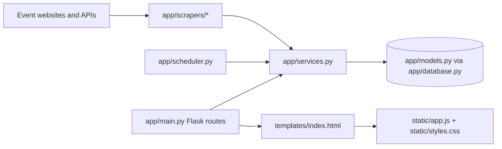

# Five-Minute Mental Model

Hong Kong Event Time is a single Flask web app that turns event listings into a browsable Hong Kong calendar. Think of it as a small pipeline: collect event data, clean it, store it, serve it, and render it in the browser.

For active recall, use the paired [quiz prep cards](quiz-prep.md).

## Flow

1. Sources are Hong Kong event websites and APIs.
2. Scrapers in `app/scrapers/` fetch raw events and convert them into `ScrapedEvent` objects.
3. `app/services.py` filters past, duplicate, off-category, or low-quality events, infers a category, and upserts valid rows.
4. The database layer uses SQLAlchemy models from `app/models.py` and sessions from `app/database.py`.
5. Flask routes in `app/main.py` serve the page, API data, health checks, manual scraping, and source diagnostics.
6. The browser UI in `templates/index.html`, `static/app.js`, and `static/styles.css` turns API responses into a calendar/list experience.
7. `app/scheduler.py` starts the daily scrape in production so the data keeps refreshing.

## Quiz Glossary

- **Single Flask stack**: The only app stack is `app/`, `templates/`, `static/`, `run.py`, and `wsgi.py`. Do not add back FastAPI or Next.js. See [AGENTS.md](../AGENTS.md).
- **Source**: An external event site or API configured in [`app/scrapers/sources.py`](../app/scrapers/sources.py).
- **Scraper**: Code that fetches and parses one source. Shared scraper types live in [`app/scrapers/base.py`](../app/scrapers/base.py) and source implementations live in [`app/scrapers/`](../app/scrapers/).
- **ScrapedEvent**: The normalized in-memory event shape passed from scrapers into services. Defined in [`app/scrapers/base.py`](../app/scrapers/base.py).
- **Category inference**: Logic that labels events as music, party, food, business, and similar categories. See [`app/categories.py`](../app/categories.py).
- **Quality filter**: Rules in [`app/services.py`](../app/services.py) that reject generic, duplicate, old, or low-information events before storage.
- **Upsert**: Update an existing event when its external ID already exists, otherwise insert it. Implemented in [`app/services.py`](../app/services.py).
- **SQLAlchemy model**: The database representation of an event in [`app/models.py`](../app/models.py).
- **Flask route**: A URL handler in [`app/main.py`](../app/main.py), such as `/`, `/health`, `/api/events`, `/api/scrape-now`, and `/api/debug/sources`.
- **Health check**: `/health` verifies the app and database are ready. Tests are in [`tests/test_health.py`](../tests/test_health.py).
- **Frontend**: The browser code in [`static/app.js`](../static/app.js) plus markup in [`templates/index.html`](../templates/index.html).
- **Scheduler**: APScheduler job startup in [`app/scheduler.py`](../app/scheduler.py), used for the daily production scrape.
- **Deployment path**: Pushes to `main` run GitHub Actions in [`.github/workflows/azure-deploy.yml`](../.github/workflows/azure-deploy.yml), deploying `wsgi:app` to Azure App Service.

## Two-Minute Explanation

"The app collects Hong Kong events from configured websites and APIs. Each scraper converts messy source data into the same event shape. The service layer removes weak results, assigns categories, and stores good events through SQLAlchemy. Flask exposes API routes for events, categories, health, scraping, and diagnostics. The page uses those APIs to render a calendar/list UI. In production, GitHub Actions deploys the Flask app to Azure App Service, and the scheduler refreshes event data daily."
